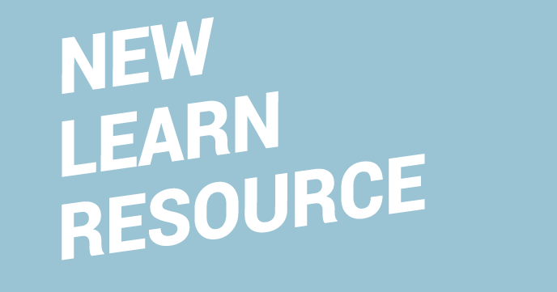

# Micromine Bitcraft

You can use your micro:bit with some Python code to help (or sabotage!) Steve in Minecraft.
You are going to connect your micro:bit’s pins to the Raspberry Pi GPIO pins using some cables and crocodile clips; programs on the micro:bit and Raspberry Pi will make Steve shake in Minecraft when the micro:bit is shaken, and will make blocks disappear when button A is pressed.

## Licence

Unless otherwise specified, everything in this repository is covered by the following licence:

***Micromine Bitcraft*** by [Martin O'Hanlon](https://github.com/martinohanlon) and the [Raspberry Pi Foundation](http://www.raspberrypi.org) is licenced under a [Creative Commons Attribution 4.0 International License](http://creativecommons.org/licenses/by-sa/4.0/).

Based on a work at https://github.com/raspberrypilearning/micromine-bitcraft
