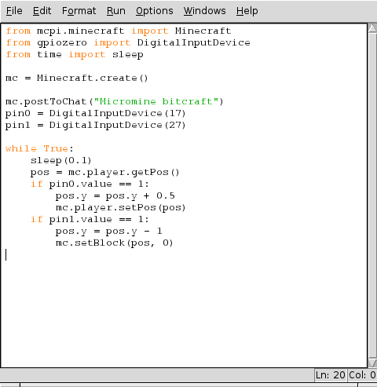
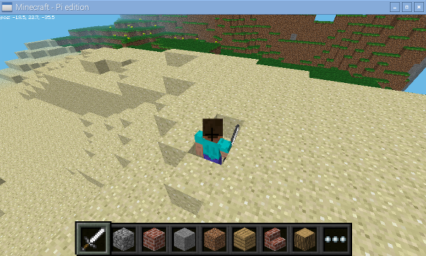

## Make blocks disappear 

Remember that we added some code to detect when button A on your micro:bit was pressed? Let's use that button press to make blocks disappear from Minecraft!

- Underneath the lines of code you have written to connect GPIO 17 to micro:bit pin 0, add another line of code to connect `GPIO 27` to `pin 1` by typing:

	```python
    pin1 = DigitalInputDevice(27)
    ```
    
- At the bottom of your program, inside the `while True` loop, add the code shown so that if `pin 1` is on or `(1)` it sets the block below Steve to Air `(0)`:

	```python
    if pin1.value == 1:
        pos.y = pos.y - 1
        mc.setBlock(pos, 0)
    ```    
    
    

- Run your program, press the A button on your micro:bit and see the blocks below Steve disappear.

	

