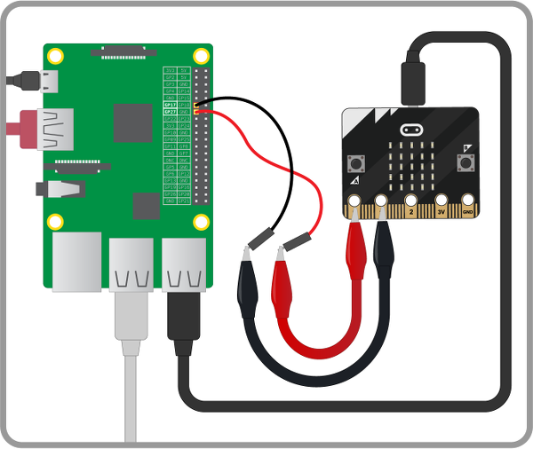

## Connect it to your Raspberry Pi

Next, you will use jumper cables and crocodile clips to connect your micro:bit to a Raspberry Pi: you will connect two of the GPIO pins on the Raspberry Pi to the `0` and `1` pins on the micro:bit.

- Connect one female-to-male jumper wire to the GPIO 17 pin on the Raspberry Pi
- Clip the crocodile clip to the male end of the jumper wire
- Clip the other end of the crocodile clip to pin 0 on the micro:bit
- Then repeat the steps above with GPIO 27 on the Raspberry Pi (which is next to GPIO 17), connecting it to pin 1 on the micro:bit.

	

