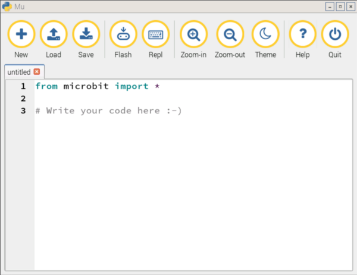
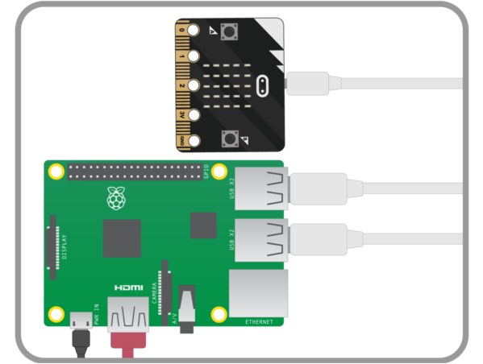
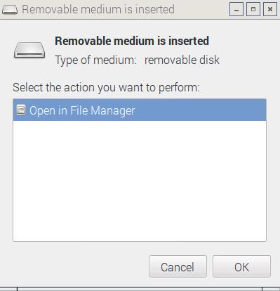
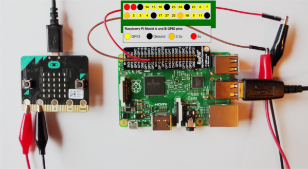
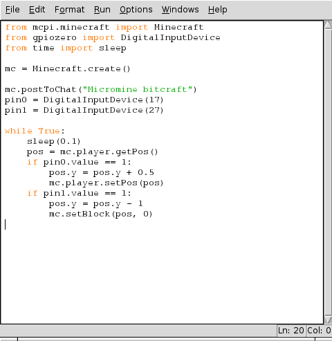
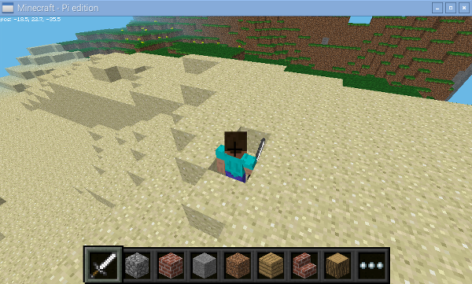

# Micromine bitcraft

Use your micro:bit to help (or sabotage!) Steve in Minecraft by connecting the pins on your micro:bit to the General-Purpose Input/Output (GPIO) pins on your Raspberry Pi using some cables and crocodile clips. Then, using Python, write programs to detect motion from the micro:bit's accelerometer and make Steve shake in Minecraft!

## Starting mu

1. Open **Mu** from the main menu under **Programming**.

1. A new window will open up; it should look like this:

	

## Plugging in your micro:bit

The micro:bit has a micro USB port that you can use to connect it to your Raspberry Pi. This will provide a power and data connection.

1. Connect your Raspberry Pi to the micro:bit using a USB A-to-micro-B cable, as shown below:

	

1. You'll know that the micro:bit has connected to your Raspberry Pi, because a dialogue box like the one below should pop up:

	

1. This dialogue box might pop up a few times while you're playing with the micro:bit. You can simply click on **Cancel** when it does.

## Write a program to make your micro:bit angry

1. Click **New** and type the following code into the editor.

	```python
	from microbit import *
	
	while True:
        if accelerometer.current_gesture() == "shake":
            display.show(Image.ANGRY)
        else:
            display.show(Image.HAPPY)
    ```
    
    Here you are using a `while True:` loop that will repeat the code inside it until you quit the program. Inside the loop, you are setting an `if else` condition: if the accelerometer on the micro:bit detects shaking, then it will display an angry face on the micro:bit LEDs. Otherwise, it will show a happy face.
                
1. Click the **Flash** icon on the menu to transfer your program on your micro:bit.

1. When the yellow light on the back of your micro:bit stops flashing your program will run and you should see a happy face on your micro:bit - until it’s shaken!

**Note: Any errors will be scrolled on your micro:bit’s LEDs. If you get an error, check your code carefully. Capital letters are important: `True` is different from `true`.**

## Buttons and pins
Now you need to finish your micro:bit program so that it turns the pins on and off when it's shaken or when the button is pressed.

1. Go back to Mu and modify your program so that it turns the pins on `(1)` and off `(0)` when shaken and when button A is pressed.

	```python
	from microbit import *
    
    while True:
        if accelerometer.current_gesture() == "shake":
            display.show(Image.ANGRY)
            **pin0.write_digital(1)
        elif button_a.is_pressed():
            display.show("A")
            pin1.write_digital(1)**
        else:
            display.show(Image.HAPPY)
            **pin0.write_digital(0)
            pin1.write_digital(0)**
    ```
	
            
1. Now click **Flash** to transfer your program to your micro:bit.
1. Test your program. The letter `A` should appear on the micro:bit LEDs when the button is pressed.

## Connect it to your Raspberry Pi
Next you will use jumper cables and crocodile clips to connect your micro:bit to a Raspberry Pi: you will connect two of the GPIO pins on the Raspberry Pi to the `0` and `1` pins on the micro:bit.

1. Connect one female-to-male jumper wire to the GPIO 17 pin on the Raspberry Pi
1. Clip the crocodile clip to the male end of the jumper wire
1. Clip the other end of the crocodile clip to pin 0 on the micro:bit
1. Then repeat the steps above with GPIO 27 on the Raspberry Pi (which is next to GPIO 17), connecting it to pin 1 on the micro:bit.


	


## Shake Steve in Minecraft

You now need to create your Minecraft program to shake Steve. To do this you will need to create another Python program, this time using Pyton 3 (IDLE3).

1. First open Minecraft Pi on the Raspberry Pi by clicking on **Menu**, **Games**, and **Minecraft: Pi Edition** to run the game.
1. Click **Start Game**, then click **Create New** (or choose an existing one) to enter a world.
1. Press **ESC** to go back to the Minecraft menu while leaving the game playing.
1. Open Python 3 (IDLE3) from the programming menu.
1. Click on **File** and **New Window** to create a new program and save it as `mc_micro.py`.
1. Start your program by importing all the modules you will need.

	```python
	from mcpi.minecraft import Minecraft
    from gpiozero import DigitalInputDevice
    from time import sleep
    ```
    Here you are using three different modules: one to connect to Minecraft Pi, one to program the GPIO pins, and one to add pauses or sleeps.

1. Underneath, create a connection to Minecraft by typing:
	
	```python
	mc = Minecraft.create()
	```

1. Next, type the line of code that will post a message to the chat window:

	```python
	mc.postToChat("Micromine bitcraft")
	```
	This will let you know that your program is working. If you do not see this message when you run your program then you will know something is wrong.

1. Save and run your program by clicking `Run` and `Run Module`. You should see your message appear in the Minecraft chat window.

	**Note: Any errors will be displayed in the Python shell in red. If you get an error, check your code carefully. The message disappears from Minecraft after ten seconds: if you miss it, re-run your program.**

1. Next, create a pin which is connected to GPIO 17 on the Raspberry Pi and pin 0 on the micro:bit by typing:

	```python
	pin0 = DigitalInputDevice(17)
	```

1. Then create a `while True:` loop which repeatedly gets Steve’s position:

	```python
	while True:
        sleep(0.1)
        pos = mc.player.getPos()
        if pin0.value == 1:
            pos.y = pos.y + 0.5
            mc.player.setPos(pos)
     ```   
        
    After getting Steve's position, if `pin0` is detected as being on or `(1)` then the code instructs Minecraft to add `0.5` to Steve’s height on the `(y)` coordinate. This will look like Steve is moving. 

1. Run your program by clicking **Run** and **Run Module**. Shake your micro:bit and Steve will be shaken in Minecraft.

## Make blocks disappear 
Remember that we added some code to detect when button A on your micro:bit was pressed? Let's use that button press to make blocks disappear from Minecraft!

1. Underneath the lines of code you have written to connect GPIO 17 to micro:bit pin 0, add another line of code to connect `GPIO 27` to `pin 1` by typing:

	```python
    pin1 = DigitalInputDevice(27)
    ```
1. At the bottom of your program, inside the `while True` loop, add the code shown so that if `pin 1` is on or `(1)` it sets the block below Steve to Air `(0)`:

	```python
    if pin1.value == 1:
        pos.y = pos.y - 1
        mc.setBlock(pos, 0)
    ```    
    
    

1. Run your program, press the A button on your micro:bit and see the blocks below Steve disappear.

	

## What next?
- Can you modify the micro:bit and Minecraft program so that Button B makes blocks appear under Steve?
- Modify the Minecraft program to make different block types appear like TNT (46) or Melon (103)

